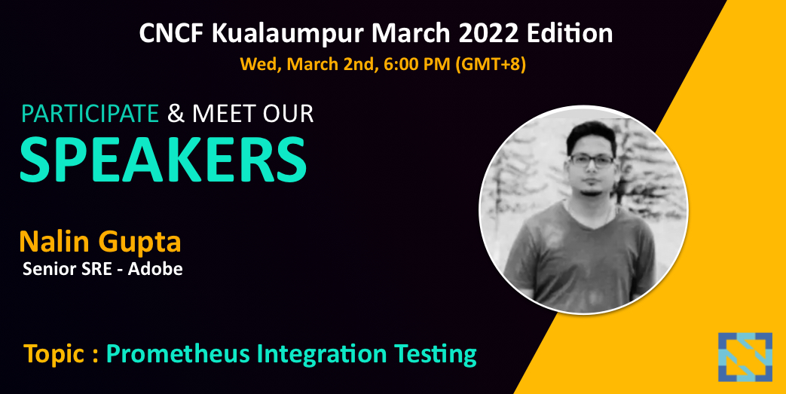

# Prometheus-integration-testing - CNCF-talk

CNCF - Kuala Lumpur talk - Prometheus Monitoring & integration testing that should be part of your CI/CD.



## Integration Tooling

* prometheus
* amtool
* promtool
* docker

## Testing command

```shell
./prometheus/auto/integration
```


## Output

```yaml
Deploying in  ENV=local

Prometheus Rules 👨‍🚀
Checking /prometheus_rules_testing.yml
  SUCCESS: 50 rules found


Prometheus Alert manager config,rules,receive 👨‍🚀
Checking '/prometheus_alertmanager_testing.yml'  SUCCESS
Found:
 - global config
 - route
 - 0 inhibit rules
 - 11 receivers
 - 0 templates


Alert manager routes tree 👨‍🚀
Routing tree:
.
└── default-route  receiver: slack-alerts
    ├── {alert_name=~"^(?:pod-alert)$"}  continue: true  receiver: slack-alerts
    │   ├── {alertname=~"^(?:PodHighMemory>99)$",pod=~"^(?:^.*(fluentd-pod|agent-pod).*$)$"}  receiver: dont-alert-receiver
    │   ├── {alertname=~"^(?:ZeroReplicaDeployment)$",deployment=~"^(?:^.*(deployment-a1).*$)$"}  receiver: pager-alert-deployment-a1
    │   └── {alertname=~"^(?:ZeroReplicaDeployment)$",deployment=~"^(?:^.*(deployment-a2).*$)$"}  receiver: pager-alert-deployment-a2
    ├── {alert_name=~"^(?:job-alert)$"}  continue: true  receiver: slack-alerts
    │   ├── {alertname=~"^(?:KubernetesJobFailed)$",job_name=~"^(?:^.*(agent-job).*$)$"}  receiver: pager-alert-agentjob
    │   ├── {alertname=~"^(?:KubernetesJobFailed)$",job_name=~"^(?:^.*(recommendation-job).*$)$"}  receiver: pager-alert-recommendationjob
    │   └── {alertname=~"^(?:KubernetesJobFailed)$",job_name=~"^(?:^.*(noncritical-jobs).*$)$"}  receiver: no-alert-noncriticaljob
    ├── {alert_name="prometheus-alert"}  continue: true  receiver: slack-cluster-alerts
    │   ├── {pager=~"^(?:alert)$"}  receiver: blank-pager-receiver
    │   └── {alertname=~"^(?:PrometheusTargetMissing)$",kubernetes_name=~"^(?:prom-metrics-service-tester)$"}  receiver: dont-alert-receiver
    ├── {alert_name="cluster-health-alert",component="node"}  continue: true  receiver: slack-cluster-alerts
    │   └── {job_name=~"^(?:^.*(xyz).*$)$"}  receiver: dont-alert-receiver
    └── {alert_name="blackbox-alert",alertname="BlackboxProbeHttpFailure"}  continue: true  receiver: slack-alerts
        ├── {instance=~"^(?:^.*(test).*$)$",pager=~"^(?:alert)$"}  receiver: test-pager
        └── {instance=~"^(?:^.*(abc).*$)$",pager=~"^(?:alert)$"}  receiver: abc-pager


Pager Receiver Testing 📟 🚨
pager-alert-deployment-a1
pager-alert-deployment-a2
pager-alert-agentjob
pager-alert-recommendationjob
test-pager
abc-pager

Non-Pager Receiver Testing 🔎
slack-alerts
no-alert-noncriticaljob
slack-cluster-alerts

Prometheus Sample Routes Testing Done ✅
```

## Kubectl workshop

Reference:
![alt text][logo]

[logo]: https://github.com/adam-p/markdown-here/raw/master/src/common/images/icon48.png ""

[Namespaces, Pods, Deployment, Scale, Secret, troubleshooting](https://github.com/nalinkantgupta/kubectl-workshop#k8-cli-workshop)

<hr>
<p align="center">
  <i>Let's connect and chat! Open to anything under the sun.</i>

  <p align="center">
    <a href="https://www.linkedin.com/in/nalinkantgupta89/" alt="Linkedin"></a>
    <a href="mailto:nalingupta74@gmail.com" alt="Contact me"></a>
  </p>

  <p align="center">
    <a href="https://visitor-badge.glitch.me/">
      
    </a>
  </p>
  <p align="center">
    <a href="https://visitor-badge.glitch.me/">
      
    </a>
  </p>
  <p align="center">
    <a href="https://visitor-badge.glitch.me/">
      
    </a>
  </p>

</p>


